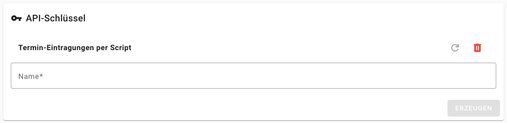
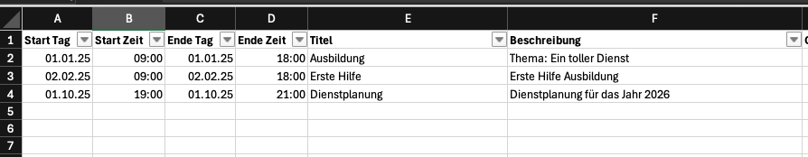
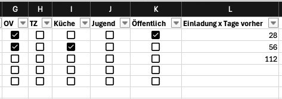

# Overview
This script can be used to enter a series of events into [GroupAlarm](https://app.groupalarm.com/) using their [REST API](https://developer.groupalarm.com/api/appointment.html). This is especially handy when a massive amount of appointments have to be handled, for instance when compiling a year's plan. 

The basic idea is: manage the appointments in an excel sheet (date, time, title, description) and select, which labels should be invited to this appointment. After collecting everything in one or several Excel sheets, you can start this script to upload and create the appointments in GroupAlarm.

# Installation
## Python Requirements
The script requires python 3 and was tested with python 3.13. The required packages are listed in the [requirements.txt](requirements.txt) file.

Ideally, you create a virtual environment for this python script:

    python -m venv /path/to/working/directory

After this, you can always start the session by sourcing the `activate` script:

    source /path/to/working/directory/bin/activate

Then, you can install the requirements with this line:

    pip install -r /path/to/repo/requirements.txt

The GroupAlarm script itself is executed after loading the virtual environment with:

    python GA_script.py -h

## Changes to the script
There is some information you need to gather and enter in the script file. It's not much, I promise.

### API Key
The script needs to communicate and authenticate with the GroupAlarm service. This is done with an API key that you have to generate in your profile. Use [this link](https://app.groupalarm.com/de/d/profile/security) or navigate to your profile into "Sicherheit" and further below "API-Schlüssel".

__Be aware that all actions will happen under your user name!__

The key allows access to everything the API allows and your user is allowed to do. So be careful with it. Don't share it. Don't upload it.

Replace the key that you've got here in the script in line 9:

    API_PERSONAL_KEY = "123456789"  # Replace with your personal API key (keep this secret!)

### Organization
The easiest way to figure out the ID of your information is by logging into GroupAlarm and check the URL. After selecting your [organization](https://app.groupalarm.com/de/d/organizations), you should see a number after the string `https://app.groupalarm.com/de/d/organizations/`, so for instance:

    https://app.groupalarm.com/de/d/organizations/12345

In this case, 12345 would be the ID of your organization. Copy this number and enter it in line 12:

    ORGANIZATION_ID = 12345  # Replace with your organization

### Label IDs
The final customization of the script is the mapping of labels. For readability, the Excel sheet uses names for groups, but the API requires IDs. So we need to map those. Open the labels of your organization in GroupAlarm and check the table. The first column lists the ID of each label.

Use this information to edit the mapping in lines 22 and following:

    def assign_label_IDs(row):
        labelIDs = []
        labelIDs.append(1) if label_is_set(row, "OV") else 0
        labelIDs.append(2) if label_is_set(row, "TZ") else 0
        return labelIDs

The IDs of GroupAlarm and script need to be identical while the names of the Excel sheet and the script needs to match.

# Usage
## Excel File
The Excel file contains one or more sheets. This might be helpful if you have a lot of appointments to manage and want to structure it a bit. Each sheet needs to contain the following columns:
- Start Tag (*starting day*)
- Start Zeit (*starting time*)
- Ende Tag (*finish day*)
- Ende Zeit (*finish time*)
- Titel (*title*)
- Beschreibung (*description*)
- {Labels}
- Öffentlich (*public*)
- Einladung x Tage vorher (*when to notify*)

### Mandatory Fields
All fields except for labels, public and notification columns are required by the GroupAlarm system. So you need to enter something here.

### Labels
You may select no label at all or define the labels that are relevant for your appointments. All labels have to be mapped to the corresponding IDs in the script (see above). Please use check boxes in the rows to indicate if a label is set or not.

### Notifications
If you leave the field blank, the notification to the invited participants is sent immediately after creation. Otherwise, the number corresponds to the number of days prior to the event when the notification is sent.

## Python Script
The script is called with the Excel file as the main parameter. Further options are described in the help screen:

    $ python GA_script.py -h
	usage: GA_script.py [-h] [-n] [-v] file

	positional arguments:
	  file           Excel file to load

	options:
	  -h, --help     show this help message and exit
	  -n, --dry_run  Just parse input but don't access the GroupAlarm API
	  -v, --verbose  Increase output verbosity

### Multiple Sheets 
If your Excel file contains more than one sheet, the script will detect it and ask you, with which one you want to proceed:

	$ python GA_script.py -n Example.xlsx 
	There are 2 sheets in this document:
	0: Dienstkalender
	1: Jugend
	Please enter the number of the sheet you like to read:  

### Test Runs
I highly recommend to start with only one appointment. If something is messed up, you just need to delete one appointment in GroupAlarm and not 10s or 100s. There is no undo option in this script, once a request to the API server was successful, the appointment is stored.

Also helpful are dry runs to check if what you have entered in the Excel file is recognized by the script.
